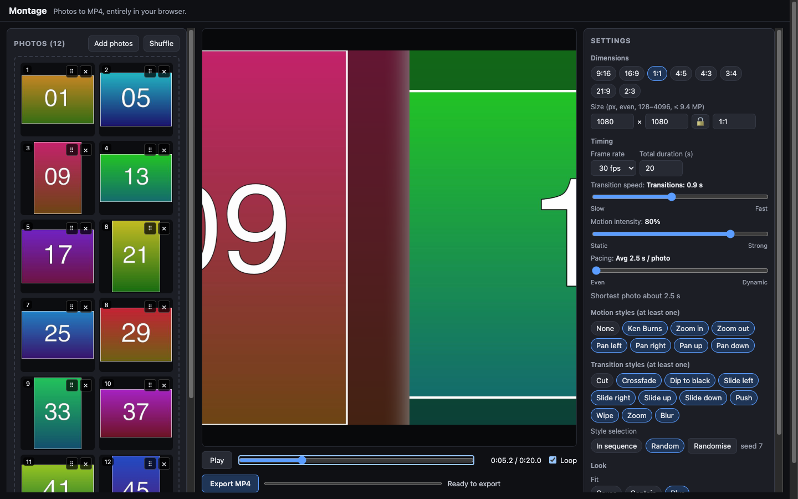

# Montage

Turn photos into an MP4 montage, entirely in the browser.

**Try it:** https://grahamlehr.github.io/montage/ (latest desktop Chrome)



## Features
- Drop in ~50 photos: JPEG, PNG, WebP, AVIF, GIF (first frame) and **HEIC/HEIF**. Reorder, remove, shuffle.
- Any output size: presets (9:16, 16:9, 1:1, 4:5, 4:3, 3:4, 21:9, 2:3) or arbitrary W×H from 128 to 4096 px per side,
  up to 9.4 MP in total (e.g. 4096×2304 or 3072×3072) — the largest frame Chrome's H.264 encoders accept.
- Set the total length; per-photo timing is derived, with an optional dynamic rhythm.
- Motion styles (Ken Burns, zoom, pan) and 11 transitions, combined from pools in sequence or seeded
  random order, with per-photo overrides.
- Three independent sliders: transition speed, motion intensity, pacing.
- Exports H.264 MP4 via WebCodecs (hardware encoder when available) and Mediabunny. No audio.

## Requirements
Latest desktop **Google Chrome**. Other browsers aren't supported.

## Privacy
Everything runs locally in your browser. Photos are never uploaded anywhere.

## Development
```bash
npm install
npm run dev        # http://localhost:5173
```

| Script | |
|---|---|
| `npm run build` | Production build |
| `npm run typecheck` | TypeScript |
| `npm test` | Unit tests (Vitest) |
| `npm run test:e2e` | End-to-end tests in Google Chrome (Playwright) |
| `npm run lint` / `npm run format` | ESLint / Prettier |
| `npm run fixtures` | Generate test photos (macOS, uses `sips`) |

## Architecture
A React UI builds a deterministic timeline (`buildTimeline` → `frameAt(t)`) that a WebGL2 renderer draws
into the preview canvas. Export runs in a Web Worker: it re-decodes the photos at export size, renders the
same frames to an `OffscreenCanvas`, encodes them with `VideoEncoder` and muxes the result with Mediabunny.
See [PLAN.md](PLAN.md) for the full design.
